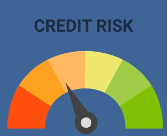

# Credit Risk Analysis


# Overview

          
Credit risk is an inherently unbalanced classification problem, as good loans easily outnumber risky loans. Therefore, a bank or lending company will need to employ different techniques to train and evaluate models with unbalanced classes. 

In this project, I will be using several different methods to calculate Credit Risk and return which algorithm was the best at Predicting the Credit Risk of the Data Set I chose.  I will be using a credit card dataset from LendingClub, a peer-to-peer lending services company.  I will use tools to _Over Sample_ the data, _Under Sample_ the data, using machine learning techniques to predict whether the algorithm, with the data set, produced a high percentage of true outcomes. 

For Deliverable 1, I will use Resampling Models to Predict Credit Risk.

For Deliverable 2, I will use the SMOTEENN Algorithm to Predict Credit Risk.

For Deliverable 3, I will use the Ensemble Classifiers to Predict Credit Risk.

The results of the above, will allow me to provide an analysis of which machine language algorithm worked best for Predicting the Outcome for Credit Risk. 


## Analysis Process
All of the processes below follow the same 'overall' steps, with different functions to analyze the data.  Using Scikit-learn machine learning library for Python.  The steps will be as follows:
1)  Read the data into a Python DataFrame
2)  Check the balance of our target values
3)  Split the data into Training and Testing data sets (75% to Training 25% to Testing)
4)  Create the model (the algorithm you will use)
5)  Train the data set with the above Algorithm
6)  Calculate the balanced algorithm score
7)  Create a confusion matrix
8)  Create a confusion DataFrame and analyize the results

# Resources
* Data Sources: LoanStats_2019Q1.csv
* Software: Jupyter Notebook, Python 3.7, Pandas

# GitHub Application Link

<a href="https://jillibus.github.io/Credit_Risk_Analysis">Credit Risk Analysis</a>

# Deliverable 1: Using Resampling Models to Predict Credit Risk

The Data Set was a great candidate for the Resampling Algorithm, as the data was unbalanced. The values of the low_risk versus the high_risk data, were just too different to obtain an optimal prediction.
```
Counter({'low_risk': 51352, 'high_risk': 260})
Counter({'low_risk': 17118, 'high_risk': 87})
```

For my analysis, there are 2 ways to use resampling, you can _Over Sample_ and _Under Sample_. 

### Over Sampling
 Using the RandomOverSampler, I resampled the X and Y data, and the Counter returned an equal paring.
```
from imblearn.over_sampling import RandomOverSampler

ros = RandomOverSampler(random_state=1)

# Resample the targets
X_resampled, y_resampled = ros.fit_resample(X_train, y_train)
Counter(y_resampled)

Counter({'low_risk': 51352, 'high_risk': 51352})
```
This allowed me to analyize the low_risk versus the high_risk with even data.


The next method, I used using Under


f
Thank you for your time and let me know if you wish to see any additional data.

Jill Hughes
